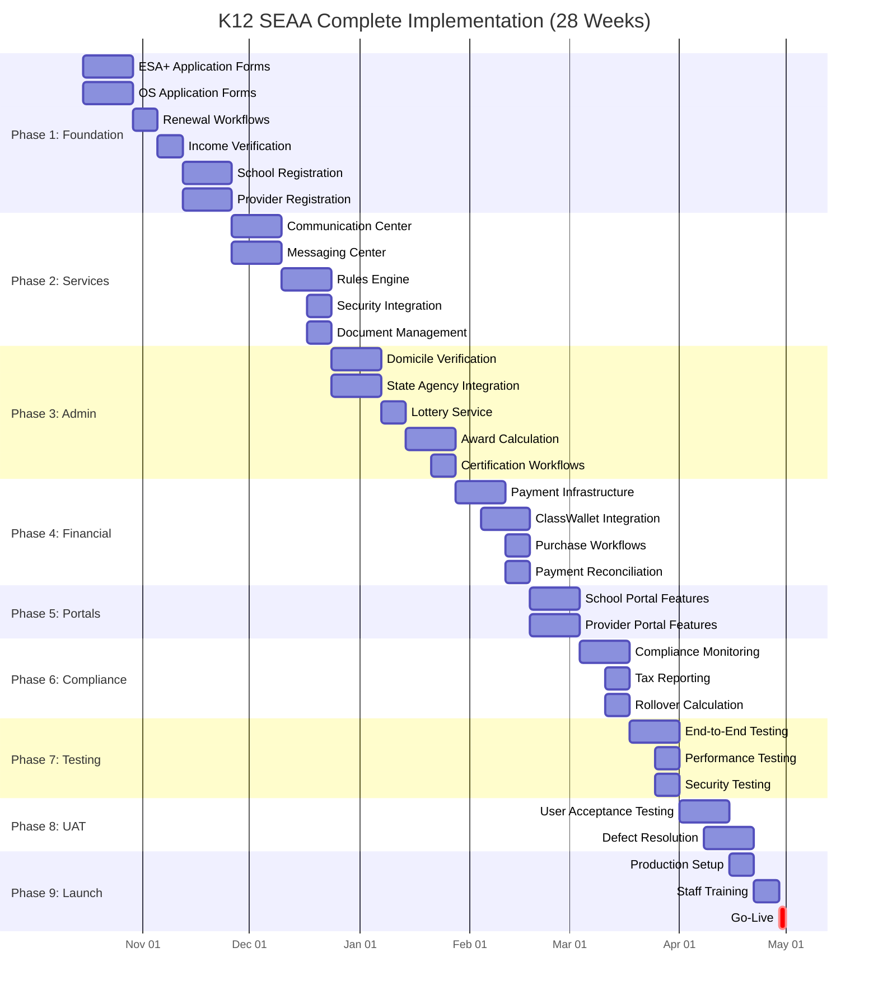

# K12 Technical Roadmap and EB Plan

<!--  -->

<!--  
SPEAKER NOTES:
- Matt Vaughn, Solutions Architect
- 20+ years in IT
- Financial Services, Healthcare, and Travel
- Largest application: 50K/second, each transaction delivering data payloads to ad networks
-->

---

## K12 Modernization: Comprehensive Implementation Plan

**Presentation Date:** October 2025  
**Audience:** Senior IT Leadership & Business Stakeholders  
**Duration:** 60 minutes (45 min presentation + 15 min Q&A)  
**Timeline:** October 30, 2025 - May 1, 2026 (28 weeks)

---

## K12 Modernization

IT Stakeholder Presentation  
October 2025

- College Foundation, Inc.  
- North Carolina SEAA Programs
- **Timeline:** October 15, 2025 - May 1, 2026

---

## Agenda

1. **Executive Summary** – Project overview and timeline
2. **Platform Overview** – Complete system scope
3. **Complete Feature Inventory** – All core capabilities
4. **Implementation Roadmap** – Phased delivery plan
5. **Resource Allocation** – Team structure and assignments
6. **Risk Assessment** – Critical areas and mitigation
7. **Success Criteria** – Delivery milestones and quality metrics
8. **Next Steps** – Execution and monitoring

---

## Executive Summary

---

### Complete K12 Modernization Scope

**Timeline:** October 15, 2025 - May 1, 2026 (28 weeks)

**Platform Serves:**

- Two scholarship programs (ESA+, Opportunity Scholarship)
- Up to 80,000 concurrent users
- Four web portals (Household, School, Provider, Admin)
- Comprehensive scholarship lifecycle management

---

### Core Capabilities Required

1. **Household & Student Management (15+ features):** This domain covers the core entry points for end-users. Critical features include the **ESA+ and OS application workflows**, **renewal processes**, and student profile and account management.
2. **School Management (20+ features):** This focuses on institutional requirements, including **school registration and profiles**, **annual certification workflows**, and the crucial, time-sensitive **semester parent endorsement** process.
3. **Provider Management (12+ features):** This involves managing service providers (tutors, therapists) who accept ESA+ funds. Key features include **provider registration and enrollment**, the public **provider directory**, and **invoice submission and processing**.
4. **Admin Portal Operations (30+ features):** This is the operational core for SEAA staff, enabling **application processing and review**, **verification management** (domicile, income, sampling), **award management** (lottery, calculation, lifecycle), and necessary **reporting and analytics**.
5. **Payment & Financial Systems (18+ features):** This domain handles the disbursement of scholarship funds. Critical requirements include **direct payment school processing**, **ESA+ wallet and purchasing** (which relies heavily on ClassWallet integration), **tax reporting (1099-G)**, **rollover management**, and **minimum spending enforcement** ($1,000 threshold for ESA+).
6. **Verification & Compliance (15+ features):** This domain is critical for regulatory adherence and includes eligibility verification workflows, ongoing compliance monitoring, and **integrations with 7 state agencies**. The mandatory process of **verification sampling** (4% of applications) and handling non-cooperation falls here.

**Critical Deadline:** **May 1, 2026** - All core functionality must be production-ready

---

### Cross-Cutting Concerns Required

- Entra
- Communication Center
  - Email
  - In-application notifications
- Rules Engine
- Query Builder
- Task Engine
- PandaDocs
- Audit and Logging
- PID Generator/Integration

---

### 3rd-Party Integration(s)

- ClassWallet
- RDS
- SparkPost (Email Engine)
- Aperio/CISCO Call Center (Provider Lookup)

---

### Data Migrations

- Schools
- Providers
- Household and Students
- Operational Data (existing)

---

## Platform Overview

---

### Enrollment Builder (EB) Overview

- Initial plan to use EB for "enrollment" forms
  - based on POC
  - simple workflow logic
  - limited validation
- Requires API for data submission and transitions
- Requires Data Mapper
  - Transform dynamic form data to static schema
  - Complex mapping rules

---

### Enrollment Builder (EB) Continued Development (Current)

- [ ] 2-3 resources
- [ ] Add additional/complete validation to form fields
- [ ] Need to map and create configurations for all "programs/enrollment types"
- [ ] Current estimate is 1.5 PIs to stabilize current POC version
- [ ] (2 resources) Design and implement the `Data Mapper` service to migrate data to static schema
- [ ] has dependency on complete static schema for all enrollment and registration data

---

### Enrollment Builder (EB) Continued Development (Refactor)

> Future consideration for 

- [ ] 3-4 resources
- [ ] Refactor to use State Machine tools
- [ ] Transition Logic to UI

---

### Enrollment Builder (EB) Time Estimates

- [ ] EB UI and configuration tools (2 PIs).
- [ ] Data Mapper service (1.5 to 2 PIs).

---

### Total: 110+ distinct features to implement

---

### Household & Student Management (15+ features)

- Application submission (ESA+, OS)
- Renewal workflows
- Profile and account management
- School selection and transfers
- Communication and notifications

---

### School Management (20+ features)

- Registration and profiles
- Student enrollment tracking
- Certification and endorsement workflows
- Payment and financial tracking
- Compliance and reporting

---

### Provider Management (12+ features)

- Provider registration and enrollment
- Service directory
- Invoice and payment processing
- Compliance and quality management

---

### Admin Portal Operations (30+ features)

- Application processing and review
- Verification management (domicile, income, sampling)
- Award management (lottery, calculation, lifecycle)
- Document management
- Communication and case management
- Reporting and analytics
- System administration

---

### Payment & Financial Systems (18+ features)

- Payment processing (direct payment schools)
- ESA+ wallet and purchasing
- Expense approval and compliance
- Tax reporting and reconciliation

---

### Verification & Compliance (15+ features)

- ??: State agency integrations
- Eligibility verification workflows
- Ongoing compliance monitoring
- Audit and compliance reporting

---

## Complete Feature Inventory

---

## Household & Student Management Features

---

### Household Application Workflows

- ESA+ new application (disability documentation, EDD upload, LEA Release)
- Opportunity Scholarship application (income verification, lottery)
- Renewal applications (simplified for returning students)
- Application status tracking and notifications

---

### Profile & Account Management

- Student and household information
- Contact and communication preferences
- Document storage and retrieval
- Award and payment history

---

### School Selection & Transfers

- School search and directory
- Enrollment confirmation
- Mid-year transfer requests
- School type identification (Direct Payment vs Reimbursement)

---

### ESA+ Purchasing (ClassWallet):

- Browse allowable expenses
- Submit purchase requests
- Track approvals and payments
- View transaction history

---

### Communications

- To-Do lists and tasks
- Email/SMS notifications
- In-app messaging
- Document upload reminders

---

## School Management Features

---

### Registration & Profile:

- School registration workflow
- DNPE verification
- School type classification
- Banking information for payments
- Administrator account management

---

### Student Enrollment:

- Student roster management
- Enrollment confirmations
- Semester updates
- Transfer processing
- Enrollment reporting

---

### Certification & Endorsement

- Annual school certification (tuition/fees)
- Parent endorsement requests (semester)
- Deadline tracking and reminders
- Certification approval workflow

---

### Payment & Financial

- Payment schedule visibility
- Expected payment calculations
- ACH deposit tracking
- Payment reconciliation
- Dual award allocation (OS + ESA+)

---

### Compliance

- Testing requirements (grades 3-12, July 15 deadline)
- Financial review (70+ students, CPA requirement)
- Background checks (school leadership)
- Compliance reporting

---

### School Portal

- Dashboard with key metrics
- Student scholarship list
- Payment history
- Document management
- Communication center

---

## Provider Management Features

---

### Registration & Enrollment

- Provider application submission
- Credentials and license verification
- Background check processing
- Service category selection
- Provider agreement signature
- Approval workflow

---

### Provider Directory

- Public provider search
- Category-based browsing
- Service area filters
- Contact information
- Service offerings

---

### Invoice & Payment

- Invoice submission
- Purchase request matching
- Payment processing via ClassWallet
- Payment confirmation
- Payment history
- Reconciliation

---

### Provider Compliance

- Credential maintenance
- Annual reviews
- Service quality monitoring
- Complaint tracking
- Performance metrics

---

## Admin Portal Operations - Processing

---

### Application Processing

- Application queue management
- Application review workflows
- Document verification
- Data validation
- Exception handling
- Processing status tracking

---

### Eligibility Determination

- Criteria evaluation
- Income calculation
- Domicile verification review
- Disability documentation review
- Exception and appeal handling
- Decision recording and notification

---

### Domicile Verification

- Electronic verification via state agencies (DMV, DPI, Revenue, DHHS, Commerce, Elections)
- Document evidence review (utility bills, bank statements)
- Multi-evidence coordination
- Verification result tracking

---

### Income Verification (OS):

- 4% random sample selection
- IRS transcript validation
- Income calculation review
- Extension request processing

---

### Application Sampling

- Random selection (4% of applications)
- Error-prone identification
- Verification case management
- Non-compliance handling

---

## Admin Portal Operations - Awards & Documents

### Award Management

---

### Lottery Administration:

- Lottery batch creation
- Random selection processing
- Award offer generation
- Waitlist management
- Audit trail maintenance

---

### Award Calculation

- ESA+ amount determination ($9,000 vs $17,000)
- OS tiered calculation (income-based)
- Dual award ordering
- Per pupil allocation integration (DPI)
- Award recalculation for changes

---

### Award Lifecycle

- Award offer management
- Acceptance tracking
- Award activation
- Mid-year adjustments
- Renewal processing

---

### Document Management

- Document upload processing
- Type classification
- Virus scanning
- Review workflows
- Approval/rejection
- PandaDocs e-signature integration
- Secure storage and retrieval

---

### Communication & Case Management:

- Bulk campaigns
- Email template management
- Scheduled notifications
- Deadline reminders
- Case assignment and tracking
- Exception queue management

---

## Admin Portal Operations - Reporting

---

### Operational Dashboards

- Application pipeline status
- Processing time metrics
- Verification completion rates
- Award utilization tracking
- Payment disbursement status
- School compliance monitoring
- Provider activity metrics
- System performance indicators

---

### Compliance Reports

- Statutory reporting
- Audit trail exports
- Financial reconciliation
- State agency coordination
- Verification completion
- Award distribution analysis
- Fraud detection indicators

---

### Business Intelligence

- Program participation trends
- Geographic distribution
- Demographic insights
- Financial projections
- Resource allocation
- Capacity planning
- Performance benchmarking

---

### System Administration

- User account management (RBAC)
- Role and permission configuration
- Microsoft Entra ID integration
- Audit logging
- System configuration
- Feature flags
- Policy version control

---

## Payment & Financial Systems

---

### Payment Processing

- Payment schedule management (Aug/Sep, Jan/Feb)
- Parent endorsement validation
- Tuition and fee calculation
- Dual award allocation (OS first, then ESA+)
- ACH payment file generation
- Payment confirmation tracking
- Failed payment handling
- Payment reconciliation

---

### ESA+ Wallet (ClassWallet)

- Account provisioning
- Fund allocation after tuition
- Balance tracking
- Transaction logging
- Rollover calculation

---

## ESA+ Purchasing & Expenses

---

### Allowable Expense Categories:

- Curriculum and materials
- Tutoring and services
- Educational technology
- Therapies
- Summer programs
- AP exams
- Transportation

--- 

### Purchase Processing

- On-marketplace purchases
- Off-marketplace invoice submission
- Category validation
- Approval/rejection workflow
- Payment to vendors
- Transaction recording

---

### Compliance & Reporting

- Minimum spending ($1,000 threshold)
- Rollover management ($4,500 annual, $30,000 lifetime caps)
- Tax reporting (1099-G for non-tuition spending)
- Prohibited expense detection
- Accessory timing and frequency rules

---

## Verification & Compliance Systems

---

### State Agency Integration Platform

---

#### Agency Integrations Required

- **DMV** - Driver's license/ID verification
- **DPI** - School enrollment, per pupil allocation
- **Department of Revenue** - Tax filing verification
- **DHHS** - Public benefits verification
- **Department of Commerce** - Public benefits
- **State Board of Elections** - Voter registration
- **State CIO** - Infrastructure coordination

---

#### Integration Capabilities

- Electronic verification requests
- Response processing and validation
- Timeout and error handling
- Manual fallback workflows
- Data privacy compliance
- Integration health monitoring
- Response time SLA tracking

---

### Eligibility Verification

---

#### Domicile Determination

- G.S. 115C-366 implementation
- Multiple evidence types
- Electronic verification priority
- Document upload alternatives
- Conflicting evidence resolution

---

#### Disability Verification (ESA+)

- EDD validation
- IEP/504 plan review
- Prior public school verification

---

#### Income Verification (OS)

- Income calculation worksheet
- IRS transcript validation
- Income tier determination

---

### Ongoing Compliance

---

#### Annual Verifications

- Per pupil allocation update (DPI, Dec 1)
- School testing compliance (July 15)
- School financial reviews (70+ students)
- Provider credential renewals
- Background check renewals

---

#### Audit & Reporting

- Immutable event logging
- Compliance audit trail
- Regulatory reporting
- Exception tracking
- Fraud detection

---

## Cross-Cutting Platform Services

---

### Essential Infrastructure for All Features

---

#### Communication Center

- Email template engine
- Scheduled campaigns
- Event-triggered notifications
- Deadline reminders
- Multi-channel delivery (Email, SMS, Print/Mail)
- Localization (EN/ES)

---

#### Messaging Center

- In-app notifications
- Banner alerts and modals
- Message inbox
- To-Do task orchestration
- Real-time updates

---

#### Rules Engine

- Eligibility calculation rules
- Income verification rules
- Award calculation logic
- Purchase approval rules
- Compliance requirements
- Policy versioning (by program year)

---

#### Document Service

- Secure storage (Azure Blob)
- Document lifecycle management
- Virus scanning
- PandaDocs e-signature integration
- Access controls
- Retention policies

---

#### Identity & Security

- Microsoft Entra ID integration
- Role-based access control (RBAC)
- Multi-factor authentication
- Single sign-on (SSO)
- Security audit logging

---

#### Query & Reporting

- Cube.js reporting layer
- Ad-hoc query builder
- Pre-built report templates
- Dashboard visualizations
- Data export capabilities

---

#Implementation Roadmap - Complete Timeline

### 28-Week Phased Delivery Plan (Oct 15, 2025 - May 1, 2026)

---

## Roadmap Recommendation (Phase 1)

---

### Enrollment Builder (EB) Decision

---

#### Risks Identified

- High complexity and uncertainty
- Significant development effort to date
- Require 1.5 PIs to Stabilize current POC version
- Potential delays impacting May 1, 2026 deadline
- Limited flexibility for future changes
- Performance concerns at scale
- Enrollment Builder UI limitations
- Naive POC Architecture

---

#### Data Mapper Challenges

- Complex mapping rules
- Error handling and validation
- Performance at scale
- Maintenance burden
- Current Architecture limitations

---

#### Noted Feature Limitation

> **Prompts cannot support self-service for:​**
>
> - Developing new prompts ​
> - Any system functionality beyond data gathering​
>
> The kinds of changes above will always require a support ticket for custom development by CFI. *- Original CFI/SEAA Proposal*

---

### Enrollment Builder (EB) Paused

> The current Enrollment Builder (EB) POC will be paused until the core platform is delivered and stable.​

---

### Key Recommendations for CORE

1. Focus on core features first
   1. Parallel development approach
2. Angular Reactive Forms
   1. Advanced validation, type-safe, well-tested
   2. Advanced form patterns
   3. Accessibility compliance
3. Cross-cutting services early
   1. Foundation for all features
4. Data Migration early/continuous

---

## Roadmap Recommendation (Phase 2)

---

### Dynamic Forms Approach

- Enrollment Builder (EB re-imagined)
- Dynamic Form Generation to supplement core forms
  - scope: limited, targeted use cases, meta-data use
- integration with ad-hoc Query Builder

---

## Implementation Roadmap - Phase Details

- **Sample**...

---

### Phase 1: Foundation & Core Applications (Weeks 1-8)

**Weeks 1-4 (Oct 15 - Nov 11):**

- ESA+ and OS application forms (reactive forms)
- Application submission workflows
- Document upload integration
- Basic student profile management
- Application status tracking

**Weeks 5-8 (Nov 12 - Dec 9):**

- Renewal workflows (both programs)
- Income verification workflow
- Eligibility determination submission
- Household profile management
- School registration and profile
- Provider registration workflow

**Deliverable:** Families can submit applications, schools and providers can register

---

### Phase 2: Cross-Cutting Services (Weeks 9-12)

**Weeks 9-10 (Dec 10 - Dec 23):**

- Communication Center (email templates, triggers)
- Messaging Center (in-app notifications)
- Microsoft Entra Security integration
- Document Management (PandaDocs)

**Weeks 11-12 (Dec 24 - Jan 6):**

- Rules Engine integration
- Query Builder (Cube.js) foundation
- Basic reporting dashboards

**Deliverable:** Communication infrastructure operational, security implemented

---

### Phase 3: Advanced Workflows & Admin (Weeks 13-16)

**Weeks 13-14 (Jan 7 - Jan 20):**

- Domicile verification workflows
- State agency integration framework
- Verification sampling service
- Admin application review workflows

**Weeks 15-16 (Jan 21 - Feb 3):**

- Lottery service implementation
- Award calculation engine
- Award lifecycle management
- School certification workflows
- Parent endorsement workflows

**Deliverable:** Complete admin processing capabilities, awards can be offered

---

### Phase 4: Financial & Payment Systems (Weeks 17-18)

**Weeks 17-18 (Feb 4 - Feb 17):**

- Payment processing infrastructure
- ACH payment file generation
- ClassWallet integration
- ESA+ purchase request workflows
- Expense approval rules engine
- Payment reconciliation

**Deliverable:** End-to-end payment processing operational

---

### Phase 5: School & Provider Portals (Weeks 19-20)

**Weeks 19-20 (Feb 18 - Mar 3):**

- School portal features (dashboard, roster, certification, payments)
- Provider portal features (directory, invoicing, payments)

**Deliverable:** Schools and providers have full self-service capabilities

---

### Phase 6: Compliance & Reporting (Weeks 21-22)

**Weeks 21-22 (Mar 4 - Mar 17):**

- Compliance monitoring workflows
- Testing requirement tracking
- Financial review management
- Background check tracking
- Tax reporting (1099-G)
- Rollover calculation
- Minimum spending enforcement

**Deliverable:** Full compliance and regulatory reporting capabilities

---

### Phases 7-9: Testing & Launch (Weeks 23-28)

**Weeks 23-24 (Mar 18 - Mar 31):**

- End-to-end workflow testing
- Performance and load testing (80K users)
- Security testing and penetration testing
- Integration testing (all external systems)

**Weeks 25-26 (Apr 1 - Apr 14):**

- User acceptance testing
- Defect resolution
- Performance optimization
- User feedback incorporation

**Weeks 27-28 (Apr 15 - Apr 28):**

- Production environment setup
- Data migration and validation
- Staff training
- Documentation finalization

**May 1, 2026: Production Launch** ✅

---

## Resource Allocation & Team Structure

---

### Development Teams (16 FTE Total)

---

#### Frontend Team (7 FTE)

- Angular application development (4 portals)
- Reactive forms implementation
- Portal UI components
- Responsive design and accessibility
- Material UI integration

---

#### Backend Team (7 FTE)

- .NET API development
- Business logic implementation
- Database schema design and optimization
- Integration development
- Performance optimization

---

#### Integration Team (2 FTE)

- ClassWallet API integration
- PandaDocs integration
- ??: State agency connections (7 agencies)
- Payment rails integration
- External system coordination

---

#### QA Team (2-4 FTE)

- Test plan development
- Automated testing (unit, integration, E2E)
- Manual testing
- UAT coordination
- Defect tracking and resolution

---

#### Subject Matter Experts (6 FTE)

- Business analyst (requirements)
- DBA (database optimization)
- ?? Security specialist (compliance, penetration testing)
- DevOps Lead (infrastructure, CI/CD)

---

## Risk Assessment - High Priority

---

### Critical Risk Areas & Mitigation

---

#### State Agency Integrations (HIGH RISK)

- **Challenge:** 7 different agencies, varying APIs, unknown response times, coordination complexity
- **Mitigation:**
  - Early integration testing starting Phase 3
  - Fallback to manual verification workflows
  - Regular agency coordination meetings
  - Integration health monitoring and SLA tracking
  - Dedicated integration team member

---

#### ClassWallet Integration (HIGH RISK)

- **Challenge:** Complex ESA+ workflows, vendor dependency, webhook reliability, transaction integrity
- **Mitigation:**
  - Sandbox environment testing early (Phase 4)
  - Idempotency keys for all transactions
  - Comprehensive error handling and retry logic
  - Regular vendor communication and status checks
  - Transaction reconciliation processes

---

#### Payment Processing (HIGH RISK)

- **Challenge:** Financial transactions, ACH accuracy, dual award ordering, regulatory compliance
- **Mitigation:**
  - Extensive testing with sample data
  - Automated reconciliation workflows
  - Comprehensive audit trail for all transactions
  - Financial controls and approval gates
  - Regular reconciliation with schools

---

#### Data Migration (HIGH RISK)

- **Challenge:** Legacy data quality, volume, complexity, schema mapping
- **Mitigation:**
  - Early data profiling (Phase 1)
  - Iterative migration testing
  - Phased migration approach
  - Validation checkpoints
  - Rollback procedures

---

### Risk Assessment - Medium Priority

---

#### Performance at Scale (MEDIUM RISK)

- **Challenge:** 80,000 concurrent users, peak load periods (application windows, payment cycles)
- **Mitigation:**
  - Load testing starting Phase 7
  - Performance monitoring infrastructure
  - Caching strategies (Redis)
  - Database optimization
  - Azure auto-scaling configuration

---

#### User Adoption & Training (MEDIUM RISK)

- **Challenge:** Multiple user groups, varying technical proficiency, change management
- **Mitigation:**
  - Early UAT involvement (Phase 8)
  - Comprehensive training program (Phase 9)
  - User documentation and video tutorials
  - Phased rollout by user group
  - Dedicated support during launch

---

#### Scope Creep (MEDIUM RISK)

- **Challenge:** Feature requests, changing requirements, stakeholder expectations
- **Mitigation:**
  - Formal change control process
  - Phase 2 feature parking lot
  - Regular stakeholder communication
  - Sprint-level scope reviews
  - Executive escalation for scope changes

---

## Success Criteria & Quality Metrics

---

### Delivery Milestones

✅ **Phase 1 complete** - December 9, 2025  
✅ **Cross-cutting services** - December 23, 2025  
✅ **Admin features** - February 3, 2026  
✅ **Financial systems** - February 17, 2026  
✅ **Portal features** - March 3, 2026  
✅ **Compliance features** - March 17, 2026  
✅ **Testing complete** - March 31, 2026  
✅ **UAT approved** - April 14, 2026  
✅ **Production ready** - April 28, 2026  
✅ **Production launch** - **May 1, 2026** ✅

---

### Quality Metrics

- ✅ **Zero critical data integrity issues** in production
- ✅ **80,000+ concurrent users** supported (load tested)
- ✅ **<2% defect escape rate** post-UAT
- ✅ **95%+ user satisfaction** in initial surveys
- ✅ **100% regulatory compliance** (audit ready)
- ✅ **<3 second page load times** (95th percentile)
- ✅ **99.9% uptime** during business hours
- ✅ **Complete audit trail** for all transactions

---

### Business Outcomes

- ✅ ESA+ and OS applications processed **without manual intervention**
- ✅ Award calculations **automated and auditable**
- ✅ Payment disbursements **on schedule**
- ✅ Reduced support call volume (improved UX)
- ✅ Staff productivity gains from automation
- ✅ **Improved user experience** across all portals
- ✅ **Complete transparency** for families, schools, providers

---

## Dependencies & Prerequisites

---

### External Dependencies (Critical Path Items)

**Required for Phase 4 (February 2026):**

---

#### ClassWallet API** - ESA+ purchasing, wallet management

- Sandbox access needed by January 2026
- Webhook endpoints configured
- Transaction testing completed

---

#### PandaDocs API** - Document e-signatures

- API credentials and templates
- Webhook callback configuration
- Integration testing

---

#### Payment Rails** - ACH disbursement infrastructure

- Bank account setup and verification
- ACH file format specification
- Test transaction capability

**Required for Phase 3 (January 2026):**

---

#### State Agency APIs** - Domicile and income verification

- DMV, DPI, Revenue, DHHS, Commerce, Elections
- API contracts and authentication
- Test environments
- Data use agreements/MOUs

**Required for Phase 2 (December 2025):**

---

#### Azure ServiceS - Hosting, storage, identity

- Production subscription
- Microsoft Entra ID tenant
- Blob storage configuration
- APIM setup

---

#### Email/SMS Providers - Communication delivery

- Service selection and contracts
- API integration
- Template configuration

---

### Technical Prerequisites

- ✅ Development and staging environments (completed)
- ✅ CI/CD pipeline established/stable (in progress)
- ✅ Monitoring and logging infrastructure (in progress)
- ⚠️ Backup and disaster recovery (Phase 9)
- ⚠️ Production environment (Phase 9)

---

### Organizational Prerequisites

- ✅ Project governance structure
- ✅ Stakeholder approval process
- ⚠️ Change management procedures (in development)
- ⚠️ Training program development (Phase 8-9)
- ⚠️ Support team readiness (Phase 9)
- ⚠️ Communication plan execution (ongoing)

---

## Implementation Approach & Execution

### Proven Development Methodology

---

#### Technology Stack (Proven Patterns)

- Angular reactive forms (type-safe, well-tested)
- .NET APIs (scalable, maintainable)
- SQL Server (static schema, high performance)
- Azure services (enterprise-grade infrastructure)
- Material UI (accessibility compliant)

---

#### Development Approach

- Domain-Driven Design (DDD)
- Agile/Scrum methodology
- 10-day sprints
- Continuous integration/deployment
- Automated testing (unit, integration, E2E)
- Code reviews and quality gates
- Regular stakeholder demos

---

#### Parallel Development Strategy

- Frontend and backend teams work simultaneously
- Portal development in parallel (Phases 1-5)
- Testing starts early (Phase 7)
- No critical blocking dependencies
- Risk mitigation through redundancy

---

## Monitoring & Course Correction

### How We Stay On Track

---

#### Progress Tracking

- Sprint velocity monitoring
- Burn-down charts by phase
- Feature completion metrics
- Defect tracking and trends
- Integration test results
- Performance benchmarks

---

#### Risk Monitoring

- Weekly risk register review
- External dependency status
- Resource availability tracking
- Technical debt assessment
- Testing coverage metrics

---

#### Quality Gates

- Code coverage thresholds (>80% custom)
- Performance benchmarks (<3s page load)
- Security scan results (zero critical)
- Accessibility compliance (WCAG 2.1 AA)
- Load test results (80K concurrent users)

---

#### Course Correction Triggers

- Sprint velocity drops >20%
- Critical defects discovered
- External dependency delays
- Resource availability issues
- Scope creep detected

---

#### Contingency Plans

- Resource augmentation options
- Scope prioritization matrix
- Phase schedule buffers
- Alternative integration approaches
- Manual workflow fallbacks

---

#### AI & Automation??

- Developer accerleration tools (code generation)
- Automated code reviews (SonarQube)
- AI-assisted testing (test case generation)
- ChatGPT for documentation and support

## Post-Launch Support & Phase 2

---

### Production Support Plan

---

#### Launch Support (May-June 2026)

- Dedicated support team (24/5 coverage)
- Rapid response to critical issues
- User adoption monitoring
- Performance tuning
- Quick-fix deployment capability

---

#### Ongoing Support (July 2026+)

- Standard support hours (8am-6pm EST)
- Incident management process
- Change request handling
- Monthly maintenance windows
- Quarterly feature releases (minor)

---

#### Monitoring & Operations

- Application performance monitoring (APM)
- Error tracking and alerting
- User analytics
- System health dashboards
- Capacity planning

---

### Phase 2 Planning (Post-May 1, 2026)

**Evaluation Period (May-July 2026):**

- Collect operational data
- Analyze user feedback
- Identify enhancement opportunities
- Assess technical debt

**Potential Phase 2 Features:**

- Advanced reporting and analytics
- Mobile applications (native iOS/Android)
- Enhanced provider marketplace
- Automated verification improvements
- AI-powered fraud detection
- Parent self-service enhancements
- **Enrollment Builder re-evaluation** (data-driven decision)

**Phase 2 Decision Criteria:**

- Actual form change frequency
- User feedback and pain points
- Operational efficiency metrics
- ROI analysis
- Technical debt assessment
- Budget availability

---

## Key Success Factors

---

### What Makes This Plan Achievable

---

#### Focused Scope

- Clear feature inventory (110+ features)
- No nice-to-have features in Phase 1
- Proven technology stack
- Parallel development possible

---

#### Adequate Timeline

- 28 weeks from October 15 to May 1
- Realistic phase durations
- Built-in testing time (6 weeks)
- Buffer for unexpected issues

---

#### Right Resources

- dedicated FTEs
- Specialized teams (frontend, backend, integration, QA)
- SME support available
- Vendor partnerships established

---

#### Clear Governance

- Defined decision-making process
- Regular stakeholder communication
- Change control procedures
- Escalation paths

---

#### Risk Management

- Identified high-risk areas
- Mitigation strategies defined
- Contingency plans ready
- Regular risk reviews

---

#### Quality Focus

- Automated testing throughout
- Early and continuous testing
- User acceptance testing (2 weeks)
- Performance and security testing
- Quality gates at each phase

---

#### Stakeholder Alignment

- Clear requirements and priorities
- Regular demos and feedback
- Transparent communication
- Shared understanding of constraints

---
